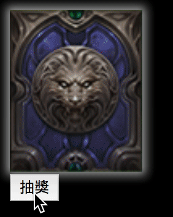
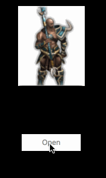
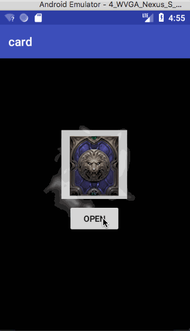
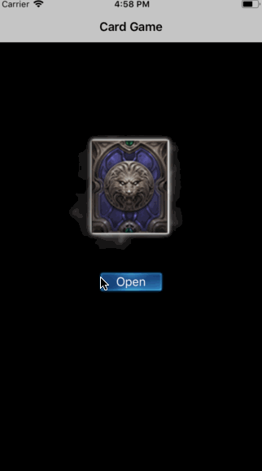

## 今日臨時挑戰賽 - 抽卡動畫

請根據上面的影片分別在 Web / iOS / Android 三個平台上模仿做一個。

參與者共 16 位：

iOS: Jeremy / 菘駿 / Morris / Iris Tsai / ethan / 
Android: Ted / Henry / York / James
Web: Coco Lin / mickey / dustfun / penguinrun / curt / Arel / 日安

### Team C: Arel / Ted / Iris / Json / Morris

每一個 team 的第一位擔任隊長。
隊長要負責分工，確保三個平台的應用都能順利完成，並完成驗收條件。

條件：
- 只能使用這個網站上的素材 http://www.olgame.tw/lm/gacha.php （你們要自己去挖出素材）。

- 每一隊的內容都要上 Github, 由隊長創建 repository, 其中 folder 分為 iOS / Android / Web / Resource (放你們挖出來的素材)

- Github 需要有 readme 一段描述 + 3個平台的 demo (錄製成 gif)

時間：從現在開始到下午 5:00

驗收：
- 模仿完整度（要用你們的觀察力去看有哪些效果要做）

---
## 作品 Demo

### Web - Arel

---
### Web - Jason

### Android

---

### iOS

